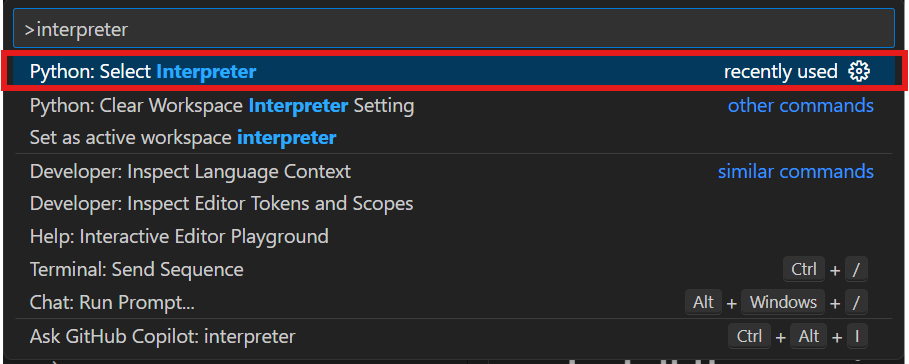
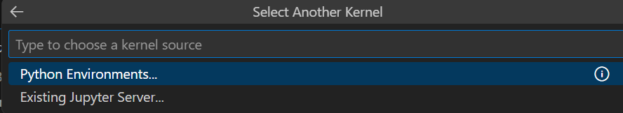
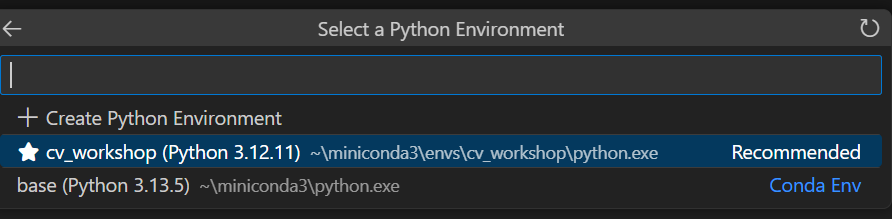

# Robotics Arm Challenge Workshop
This repository contains three tutorials for the Dobot Magician robotics arm. These tutorials will guide you in controlling the robotics arm using Python.

## IMPORTANT
**Last update: Sep 26, 2025**  
Update the workshop material and environment before the participating workshop.

## Tutorials

1. [Dobot Magician Robot Arm Control Tutorial](dobot.ipynb)
2. [YOLO Training Tutorial](cv_yolo/yolov8.ipynb) 
3. [Dobot Magician Robot Arm Calibration Tutorial](calibration.ipynb)

## Environment Setup

To run the tutorials, follow these steps:

1. **Clone the repository:**
    ```bash
    git clone https://github.com/HKUArmStrong/rac_workshop.git
    cd rac_workshop
    ```

2. **Create a conda environment:**  
    Conda Installation Information: [Click Here](conda.md)
    ```bash
    conda create -n rac_workshop python=3.10
    conda activate rac_workshop
    ```

3. **Alternatively, Create a virtual environment:**
    ### For Mac/Linux ###
   ```bash
    python3 -m venv venv
    source venv/bin/activate
    ```
    ### For Windows ###
    ```bash
    python3 -m venv venv
    venv\Scripts\activate.bat
    ``` 

4. **Install required packages:**
    ```bash
    pip install -r requirements.txt # Change the filename: See the below requirement for difference hardware and OS. 
    ```
  
### Requirements Files

Select the requirements file that matches your operating system and hardware:

- **Windows (CPU):** `requirements.txt`
- **Windows (CUDA 12.8):** `requirements-cuda.txt`
- **Linux (CPU):** `requirements-linux-cpu.txt`
- **Linux (CUDA 12.8):** `requirements.txt`
- **macOS:** `requirements-mac.txt`

### Select Python Interpreter in VSCode
Select the python environment you just create. 

  1. Press `Shift` + `Ctrl` + `P` together to open VSCode command panel
   
  2. Input `Python: Select Interpreter`

  3. Select the Python version you want

  - For example, select *base* conda virtual environment here

    

    
    
### Select Python Environment in Jupyter Notebook
Select the python environment you just create. 

For example: Choosing *cv_workshop* virtual python environment here:
  
  

  

### Known Issue
On macOS, the RealSense camera is not supported. As a result, all camera-related functions are disabled, and `calibration.ipynb` will have limited functionality.
