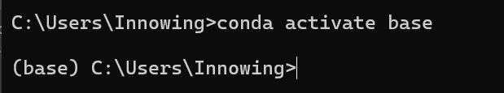
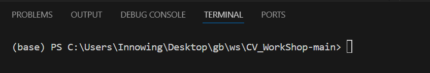
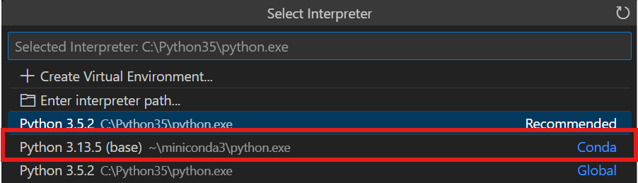

# Computer Vision (YOLO) Workshop 2025 Fall

This is the repo for CV Workshop held by Innovation Wing and SIG HKUArmStrong, Innovation Wing, HKU. 

It contains the basic YOLO usage from environment installation, YOLO training, to YOLO inferencing. A Corresponding slides is available as below.

This Workshop also serves as one of the tutorials for *Robotic Arm Challenge 2025 Fall*, Register if you feel interested! You may check it with the following Website.

Materials: [Website](https://innoacademy.engg.hku.hk/robotarm2025/) | [Self-Learning Material & Slides](https://hkuarmstrong.notion.site/Robotics-Arm-Challenge-2025-Autumn-Self-Learning-Materials-26497c42c7f38063b5b4fcb4572f9158?source=copy_link)

Enjoy and Have Fun!


# Install Conda to make a virtual environment for managing the tools

**PLEASE BE REMINDED TO TICK THE ADD TO ENV PATH OPTION For Windows**

- Go to Anaconda [installation website](https://www.anaconda.com/download/success) and install conda via installers. Both Conda and Miniconda are acceptable.
  - Check **ON** the Red Box "Add installation to my PATH" option during installation:
  - You may also want to check on the green box, if you prefer to use Conda in text editor like VSCode.

    

Note: For Conda in VSCode, you **MUST** install [Python extension for Visual Studio Code](https://marketplace.visualstudio.com/items?itemName=ms-python.python).

# Install the required environment for this workshop

In this part, we will create a virtual environment with (mini)conda, and install all the required packages and dependencies in conda virtual environment for the workshop.

(You may omit this part if you have done environment settings from the previous workshop)
```bash
# explain: conda create --name envname packages
conda create -n cv_workshop python==3.10
# check how many conda environment you have
conda env list 
# activate specific conda environment
conda activate cv_workshop 
# go to the workspace directory
cd path/to/cv_workspace # replace with actual path
pip install -r requirements.txt # You may choose to use 'requirements-cuda.txt' if you have GPU on your computer
# if packages already exist and are not the correct version, try:
pip install -r requirements.txt --force-reinstall
```

Other commands:
```bash
# activate conda virtual environment
# explain: conda activate envname
conda activate cv_workshop

# (optional) deactivate conda virtual environment
conda deactivate

# Check how many conda env we have
conda env list

# Check what packages we have installed in this conda virtual environment
conda list
```

Note: You should see a `(base)` prefix at the left end of your terminal after you activate your conda virtual environment:
- Windows Terminal

    

- VSCode Terminal

    


# RUN OUR DETECTION TASK!

Go to the [`yolov8.ipynb`](yolov8.ipynb) and play!

- Install ipykernal when running `.ipynb` for the first time, and select the python under the conda virtual environment we just created.

- For example, choosing *cv_workshop* virtual python environment here:
  
  

  
  
# FAQ

- Basic Bash command (Linux)
  ```bash
  # Navigate to a directory
  cd dir_name # replace with the real directory name
  # or 
  cd path/to/directory # replace with the actual path
  # move to father directory
  cd .. 

  # Examine current directory (Linux)
  ls 
  # or a specific directory
  ls path/to/directory # replace with the actual path

  # Examine current directory (Windows)
  dir path\to\directory # note the "\" here is different from Linux

  # Making a directory
  mkdir dir_name # replace with the real directory name

  # Notations
  / # directory level symbol in linux
  \ # directory level symbol in Windows
  . # one dot usually means current node/level, e.g., current directory, and sometimes omitted.
  .. # usually means father node/level, e.g., father directory
  ls test/.. 
  # is the same as 
  ls .
  # and the same as 
  ls

  ```

- Windows ExecutionPolicies Issus

  - Try using AI to help you generating the correct format
  ```bash
  # Set the authorization
  Set-ExecutionPolicy -ExecutionPolicy RemoteSigned -Scope CurrentUsers # CurrentUsers will be replaced by your system config
  # then source the profile.ps1
  . 'C:\path\to\profile.ps1' # should be path to the real file in your computer
  # Notice the dot in the command
  ```

- Select Python Interpreter in VSCode

  1. Press `Shift` + `Ctrl` + `P` together to open VSCode command panel
   
  2. Input `Python: Select Interpreter`

  3. Select the Python version you want

  - For example, select *base* conda virtual environment here

    

    

- Change Disk in Windows terminal
  ```bash
  cd /d D: # for example to Disk D:
  ```

- Error Debug
  ```bash
    error: subprocess-exited-with-error

    × Getting requirements to build wheel did not run successfully.
  ```
  It means your enviroment lacks some essential tools/compilers for building the packages we want to install. Usually conda install python would solve these kind of problems
  ```bash
  conda install python==x.xx.x # x.xx.x means the python version you want to install
  # in this workshop we use python 3.10
  conda install python==3.10
  ```